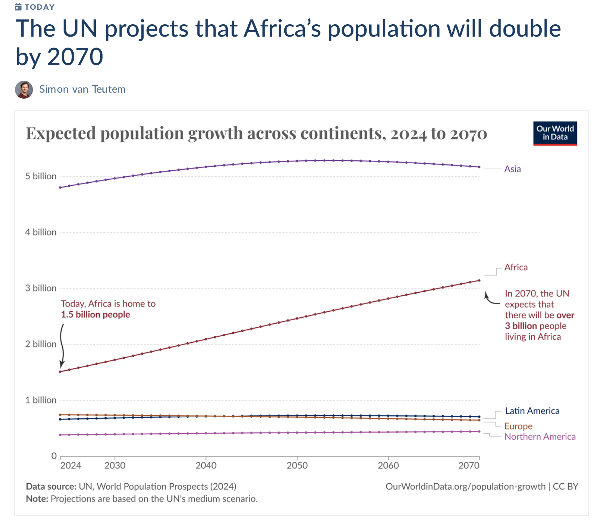

Last Updated on 2024-10-01

This has been retired now that Our World in Data is officially on Bluesky [@ourworldindata.org]([https://bsky.app/profile/owid-daily-data.bsky.social](https://bsky.app/profile/ourworldindata.org)

# Posting the Our World in Data Daily Data Insight to Bluesky

This bot posts a screen shot of the Our World in Data (OWID) Daily Data
Insight to Bluesky:
[@owid-daily-data.bsky.social](https://bsky.app/profile/owid-daily-data.bsky.social)

## Screenshots

It uses Simon Willison’s GitHub repository that takes an automated
screenshot of a OWID Daily Data Insight web page using
[shot-scraper](https://github.com/simonw/shot-scraper).

Read more about how this works in [Instantly create a GitHub repository
to take screenshots of a web
page](https://simonwillison.net/2022/Mar/14/shot-scraper-template/).

[simonw/simonwillison-net-shot](https://github.com/simonw/simonwillison-net-shot)
is an example repository created using this template.

The YAML for the OWID screenshot is defined in the `shots.yml` and the
`cron` automation for `shot-scraper` using Github Actions is in
`.github/workflows/shots.yml`

## Bluesky posting bot

Posts are done by a small R script using Johannes B. Gruber’s
[atrrr](https://jbgruber.github.io/atrrr/index.html) package and another
Github actions `bot.yml` and `bot_2.yml` similar to my [literature
bot](https://github.com/ab604/prot-paper-bot) to post the OWID
screenshot at 0715 UTC, and then repost it at 1115 UTC and 1915 UTC each
day.
